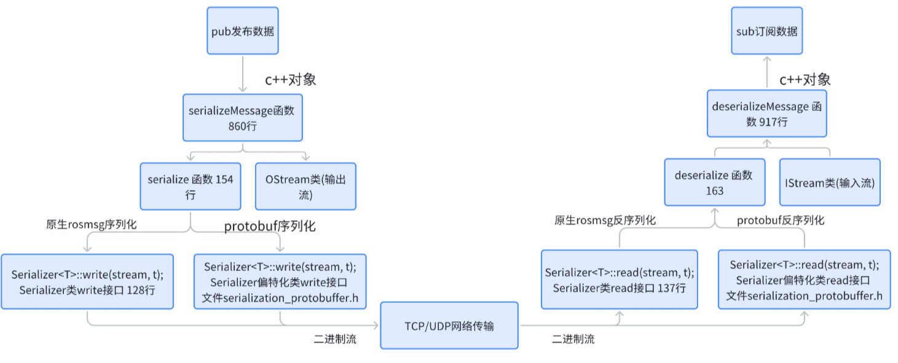

## my-ros-protobuf

my-ros-protobuf-bridge是一个基于ros和protobuf的桥接项目，旨在实现ros消息和protobuf消息之间的兼容和互操作性

- **兼容性和可扩展性**：基于C++模板编程中的**SFINAE**机制，修改了**roscpp**的核心库**roscpp_serialization**和**roscpp_traits**的底层代码。这样，**ros-protobuf-bridge可以同时兼容ROS原生msg和Protobuf消息**
- **项目管理和构建**：使用**cmake**作为项目的构建系统，编写proto测试文件生成相应的**静态库**，供ros自定义功能模块调用。简化了项目的管理和构建过程，并提供灵活的扩展机制，便于后续添加复杂数据类型
- **插件化设计**：**ros-protobuf-bridge**可以作为一个插件迁入到各种复杂的ROS功能项目中。通过将该项目中的cmake指令集成到目标项目中，可以轻松地实现基于proto数据的发布和订阅
- **构建环境自动化**：使用**docker**构建整个项目环境，通过**dockerfile**安装**ROS-Noetic**组件，**protobuf**，**cmake**等依赖项，同时使用**shell**脚本编写第三方库源码安装和容器操作脚本，以实现项目构建流程的自动化和部署的便利性。

项目流程示意图：

